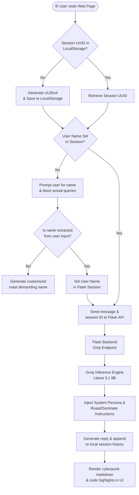

# 💀 Savage Sigma AI

> **A cyberpunk-themed AI chatbot with persistent session isolation, dynamic user name detection, and a brutal roasting persona.** Powered by Flask, the OpenAI SDK, and the Groq API (Llama 3.1 8B Instant).

[](https://genai-document-intelligence.onrender.com/)
[](https://python.org)
[](https://flask.palletsprojects.com)
[](https://groq.com)
[](https://opensource.org/licenses/MIT)

---

## 🌐 Live Production Deployment

Experience the live chatbot directly in your browser — no setup required:

| Application | Live Link | Platform |
| :--- | :--- | :--- |
| **💀 Savage Sigma AI** | [**Launch Chatbot 🚀**](https://genai-document-intelligence.onrender.com/) | Render.com (Free Tier) |

> [!NOTE]
> *Savage Sigma AI is hosted on a free Render tier. If the website has not been visited recently, the container may sleep. Please allow **30–45 seconds** for the server to spin back up on your first visit.*

---

## 🌌 What is Savage Sigma AI?

In a world filled with overly helpful, sanitised, and robotic AI assistants — **Savage Sigma AI** breaks the mold.

Inspired by cyberpunk aesthetics and the high-agency developer mindset, Sigma doesn't spoon-feed answers. It **demands your name**, challenges your basic assumptions, and **roasts you** if your queries are lazy — coaxing you to be self-reliant while delivering highly intelligent, context-aware answers.

**Who is this for?**
- Developers who want a fun, sarcastic coding companion.
- Anyone looking for a creative AI experience beyond standard chatbots.
- Students who learn better when challenged, not spoon-fed.

---

## 📐 System Architecture & Flow

The application isolates user state on the client side using local storage, communicating with a Flask API that handles multi-turn conversation memory with the Groq inference engine:



---

## 🛠️ Key Features

| Feature | Description |
| :--- | :--- |
| **💀 Savage Persona** | Aggressive, sarcastic chatbot. Roasts basic questions, respects deep ones — with dominance. |
| **🕵️ Dynamic Name Detection** | Regex-powered name extraction from sentences like *"my name is..."* or *"i am..."* with guards to prevent accidental resets. |
| **🔒 Session Isolation** | Every browser tab gets a unique UUID. Multiple users or tabs never cross-pollinate chat histories. |
| **⚡ Cyberpunk UI** | Glassmorphic neon panels, typing animations, marked.js markdown rendering, code copy buttons. |
| **⌨️ CLI Mode** | Chat directly in your terminal using `roast_bot.py` — no browser needed. |

---

## ⚙️ Run It On Your Desktop (Full Setup Guide)

> **Just want to try it quickly?** Use the [**Live Demo**](https://genai-document-intelligence.onrender.com/) — no installation needed.
>
> **Want to run your own version?** Follow every step below carefully.

### Step 1: Install Prerequisites

Make sure you have these installed on your computer:

| Tool | Download Link | How to verify |
| :--- | :--- | :--- |
| **Python 3.10+** | [python.org/downloads](https://www.python.org/downloads/) | Run `python --version` in your terminal |
| **Git** | [git-scm.com](https://git-scm.com/) | Run `git --version` in your terminal |

### Step 2: Clone This Repository

Open your terminal (Command Prompt, PowerShell, or macOS/Linux Terminal) and run:

```bash
git clone https://github.com/bharathwajverse/SAVAGE-SIGMA-AI.git
cd SAVAGE-SIGMA-AI
```

### Step 3: Create & Activate a Virtual Environment

This keeps the project's libraries isolated from your system Python:

```bash
# Create the virtual environment
python -m venv venv
```

**Activate it:**

| Operating System | Command |
| :--- | :--- |
| **Windows (PowerShell)** | `.\venv\Scripts\Activate.ps1` |
| **Windows (CMD)** | `.\venv\Scripts\activate.bat` |
| **macOS / Linux** | `source venv/bin/activate` |

> You'll see `(venv)` at the beginning of your terminal line when it's activated.

### Step 4: Install Dependencies

```bash
pip install -r requirements.txt
```

### Step 5: Create the `.env` File (API Key Setup)

You need a Groq API key to power the chatbot. **This is 100% free.**

1. **Get your API key:**
   - Go to [console.groq.com](https://console.groq.com) and sign up / log in.
   - Click **API Keys** on the left sidebar.
   - Click **Create API Key**, then **copy** the key.

2. **Create the `.env` file:**
   - In the root folder of the project (`SAVAGE-SIGMA-AI/`), create a new file called `.env`
   - Open it in any text editor and paste:
     ```env
     GROQ_API_KEY=gsk_your_actual_api_key_here
     ```
   - Save the file.

> [!CAUTION]
> **Never share your `.env` file or API key publicly.** The `.gitignore` is already configured to block `.env` from being pushed to GitHub.

### Step 6: Launch the Application

#### Option A: Web Application (Recommended)
```bash
python front.py
```
Then open your browser and go to:
```
http://127.0.0.1:5000
```

#### Option B: Terminal / CLI Chat
```bash
python roast_bot.py
```

---

## 📂 Repository Structure

```
SAVAGE-SIGMA-AI/
│
├── .devcontainer/
│   └── devcontainer.json       # VS Code remote container config
│
├── .env                        # 🔒 YOUR API KEY (not pushed to GitHub)
├── .gitignore                  # Rules for files excluded from Git
│
├── front.py                    # 🟢 Main Flask API server + web backend
├── index.html                  # 🎨 Cyberpunk HTML5/CSS3 frontend UI
├── roast_bot.py                # ⌨️  CLI version of the chatbot
│
├── main.py                     # 🧪 Simple Groq OpenAI-compat tester
├── langchain_bot.py            # 🧪 Simple LangChain integration tester
│
├── Procfile                    # 🚀 Render.com deployment command
└── requirements.txt            # 📦 Python package dependencies
```

---

## 🔒 Security Summary

| File | Status | Details |
| :--- | :--- | :--- |
| `.env` | 🔐 **Hidden** | Contains your API key. Blocked by `.gitignore` — never pushed to GitHub. |
| `__pycache__/` | 🚫 **Excluded** | Python bytecode cache. Blocked by `.gitignore`. |
| `venv/` | 🚫 **Excluded** | Virtual environment folder. Blocked by `.gitignore`. |

---

## 🛠️ Core Tech Stack

| Technology | Role |
| :--- | :--- |
| **Flask + Gunicorn** | Lightweight web framework and production WSGI server |
| **OpenAI Python SDK** | Standardized client pointing to Groq's OpenAI-compatible endpoint |
| **Vanilla HTML5 & CSS3** | Custom cyberpunk UI with neon glows, glassmorphism, and Google Fonts |
| **Groq Cloud API** | Ultra-fast Llama 3.1 8B Instant inference |

---

## 📄 License

This project is open-source under the MIT License.

---

<p align="center">
  Developed with 💀 by <a href="https://github.com/bharathwajverse">@bharathwajverse</a>
</p>
