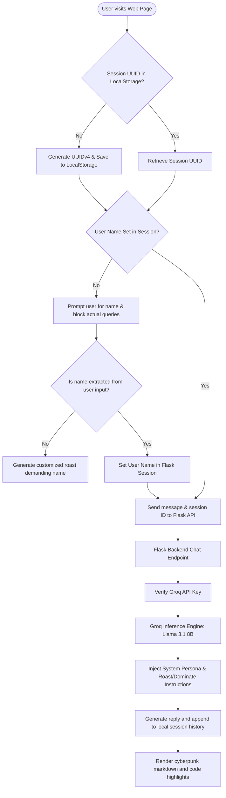

# 💀 Savage Sigma AI

> **A cyberpunk-themed chatbot with persistent session isolation, dynamic user name detection, and a brutal AI persona.** Powered by LangChain, Flask, and the Groq API (Llama 3.1 8B).

[](https://genai-document-intelligence.onrender.com/)
[](https://python.org)
[](https://flask.palletsprojects.com)
[](https://groq.com)
[](https://opensource.org/licenses/MIT)

---

## 🌐 Live Production Deployment

Experience the live application directly in your browser:

* 🚀 **Launch Chatbot:** [**Savage Sigma AI Live**](https://genai-document-intelligence.onrender.com/)
* 🖥️ **Hosting Platform:** Hosted on Render.com (Free Tier)

> [!NOTE]
> *Because Savage Sigma AI is hosted on a free Render tier, the container spins down after periods of inactivity. If the webpage does not load immediately, please allow **30–45 seconds** for the server to spin back up on your first visit.*

---

## 🌌 The Vision

In a world filled with overly helpful, sanitised, and robotic AI assistants, **Savage Sigma AI** breaks the mold. Inspired by cyberpunk aesthetics and high-agency developer mindsets, Sigma doesn't spoon-feed answers. It demands your name, challenges your basic assumptions, and roasts you if your queries are lazy—coaxing you to be self-reliant while delivering highly intelligent, context-aware answers.

---

## 📐 System Architecture & Flow

The application isolates user state on the client side using local storage, communicating with a Flask API that handles multi-turn conversation memory with the Groq inference engine:



---

## 🛠️ Key Features

* **💀 Savage Persona (Sigma AI):** Implements a dark, aggressive, and sarcastic chatbot persona. It acknowledges deep questions with dominance, but thoroughly roasts basic questions to encourage independent learning.
* **🕵️‍♂️ Dynamic Name Detection & Guards:** Automatically parses sentences (e.g. *"my name is..."*, *"i am..."*) using regex to extract your name. Once locked in, safety filters prevent simple conversational words from accidentally resetting it.
* **🔒 Tab-Level Session Isolation:** Leverages client-side browser UUIDs. If you open a new tab or browser window, it creates a fresh independent session so that multiple users (or tasks) never cross-pollinate.
* **⚡ Premium Cyberpunk UI:** A fully responsive user interface featuring glassmorphic neon panels, dynamic typing animation indicators, marked.js markdown compilation, and clean code block rendering with a copy-to-clipboard button.
* **⌨️ Command Line Interface (CLI):** Includes a local command-line interface (`roast_bot.py`) for direct, fast terminal chatting.

---

## ⚙️ Desktop Installation & Setup

Follow these simple instructions to set up and run Savage Sigma AI on your computer:

### 1. Prerequisite Installations
Make sure you have [Python 3.10+](https://www.python.org/downloads/) and [Git](https://git-scm.com/) installed on your computer.

### 2. Clone the Repository
Open your terminal (or PowerShell) and clone this repository:
```bash
git clone https://github.com/bharathwajverse/SAVAGE-SIGMA-AI.git
cd SAVAGE-SIGMA-AI
```

### 3. Initialize a Virtual Environment
Create an isolated environment to prevent library dependency conflicts:
```bash
# Create Virtual Environment
python -m venv venv

# Activate (Windows PowerShell)
.\venv\Scripts\Activate.ps1

# Activate (macOS/Linux)
source venv/bin/activate
```

### 4. Install Dependencies
Install all required libraries:
```bash
pip install -r requirements.txt
```

### 5. Configure Your Environment Variables
1. Create a file named `.env` in the root folder of the project.
2. Open the `.env` file in your editor and add your Groq API key:
   ```env
   GROQ_API_KEY=your-actual-groq-api-key-here
   ```

> [!TIP]
> **How to get a Groq API Key (100% Free):**
> 1. Sign up/Log in to [console.groq.com](https://console.groq.com).
> 2. Navigate to the **API Keys** tab on the left sidebar.
> 3. Click **Create API Key**, copy it, and paste it into your `.env` file.

### 6. Run the Application

#### A. Running the Web Application
Launch the local Flask server:
```bash
python front.py
```
After starting, open your browser and navigate to:
```url
http://127.0.0.1:5000
```

#### B. Running the CLI Application
If you prefer a terminal-based chat interface:
```bash
python roast_bot.py
```

---

## 📂 Repository File Structure

```
SAVAGE-SIGMA-AI/
├── .devcontainer/
│   └── devcontainer.json   # Configuration for VS Code remote development
├── .gitignore              # Rules for files to exclude from Git
├── Procfile                # WSGI command for deploying on Render
├── front.py                # Main Flask API and Web server backend
├── index.html              # Cyberpunk-styled HTML5/CSS3 frontend page
├── roast_bot.py            # CLI version of Savage Sigma AI chatbot
├── main.py                 # Simple Groq OpenAI-compatibility tester
├── langchain_bot.py        # Simple LangChain integration tester
└── requirements.txt        # Backend dependencies for Flask & Groq
```

---

## 🛠️ Core Tech Stack

* **Flask & Gunicorn:** Light and robust web framework for serving the app API.
* **OpenAI Python SDK:** Standardized connection client pointing to Groq's high-speed endpoint.
* **Vanilla HTML5 & CSS3:** Customized with neon glows, glassmorphism, responsive grids, and Google Fonts.
* **Groq Cloud API (Llama 3.1 8B):** Extremely low-latency LLM model serving.

---

## 📄 License

This project is licensed under the MIT License. See the [LICENSE](LICENSE) file for more details.

---

<p align="center">
  Developed by <a href="https://github.com/bharathwajverse">@bharathwajverse</a>
</p>
